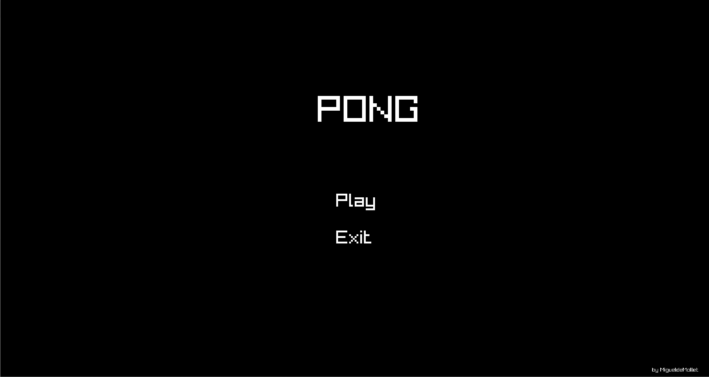
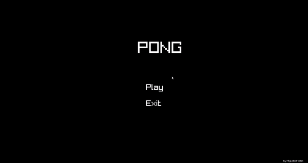
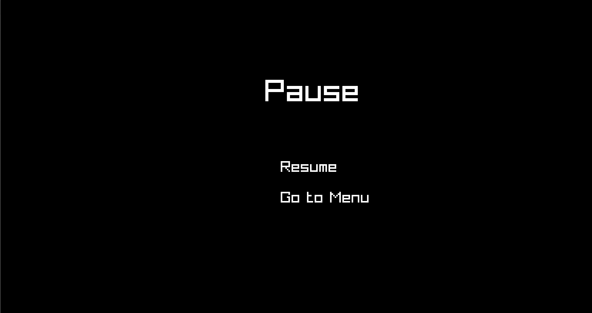
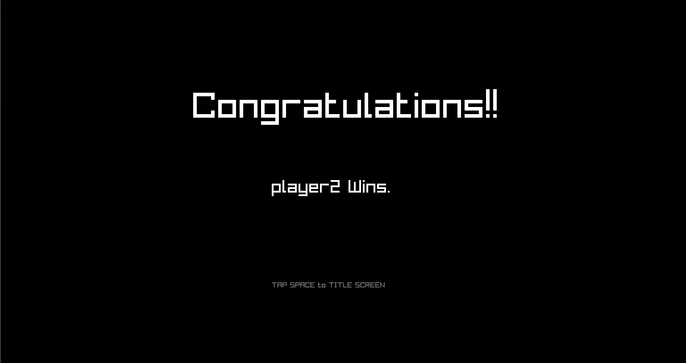

# Pong Game - C# with Raylib

Welcome to the Pong Game project! This is a classic Pong game implemented using **C#** and the **Raylib** library. The game includes several screens such as the Title screen, Gameplay screen, and Ending screen, Pause screen.

## Table of Contents
- [About the Game](#about-the-game)
- [Features](#features)
- [Installation](#installation)
- [How to Play](#how-to-play)
- [Screens](#screens)
  - [Title Screen](#title-screen)
  - [Gameplay Screen](#gameplay-screen)
  - [Pause Screen](#pause-screen)
  - [Ending Screen](#ending-screen)
- [Authors](#authors)
- [License](#license)

## About the Game

This project is a recreation of the classic Pong game, built using **C#** in combination with the **Raylib** library. The game is structured to guide the player through different stages, starting from the logo screen all the way to the ending screen.

## Features
- Simple yet addictive gameplay
- Multiple game screens: Logo, Title, Gameplay, and Ending
- Built using Raylib, a simple and easy-to-use library for game development

## Installation

1. Clone the repository:
   ```bash
   git clone https://github.com/migueldemollet/Pong-Game
   ```
2. Install **Raylib**. You can follow the instructions from the official [Raylib website](https://www.raylib.com/) for setting up the library with **C#**.
3. Compile and run the project:
   ```bash
   dotnet build
   dotnet run
   ```

## How to Play

- Player 1 (Left Paddle) controls:
  - **Up**: `W`
  - **Down**: `S`
  
- Player 2 (Right Paddle) controls:
  - **Up**: `Up Arrow`
  - **Down**: `Down Arrow`

The goal is simple: hit the ball with your paddle to prevent it from passing by, and score points by getting the ball past your opponent's paddle. First player to reach 11 points wins the game!

## Screens

### Title Screen
The title screen displays the name of the game, along with options like "Start Game" or "Exit."



### Gameplay Screen
This is where the action happens. Players control paddles to bounce the ball back and forth. The first player to score the required number of points wins the game.



### Pause Screen
Players can pause the game at any time by pressing the `ESC` key. The pause screen displays options to resume the game, or exit to the title screen.



### Ending Screen
Once a player wins, the game transitions to the ending screen, displaying the winner and options to replay or exit the game.



## Authors

- [MigueldeMollet](https://github.com/migueldemollet) (Developer)

## License

This project is licensed under the MIT License. See the [LICENSE](LICENSE) file for more information.
